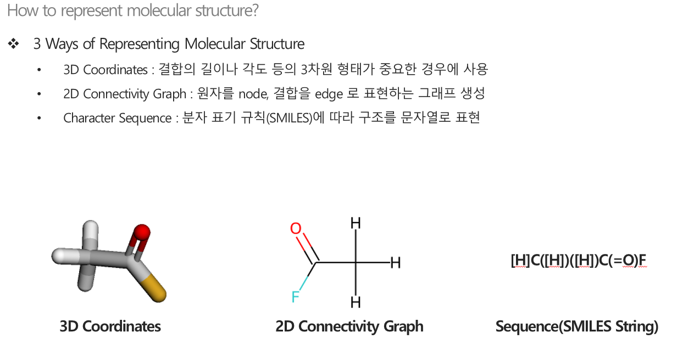
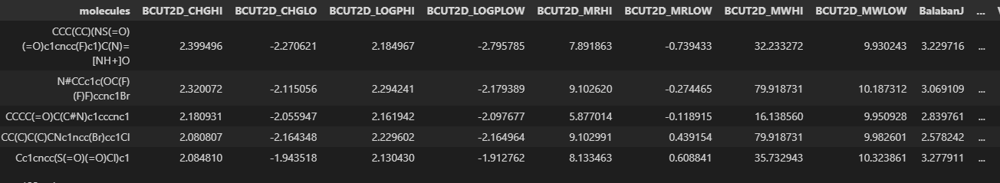
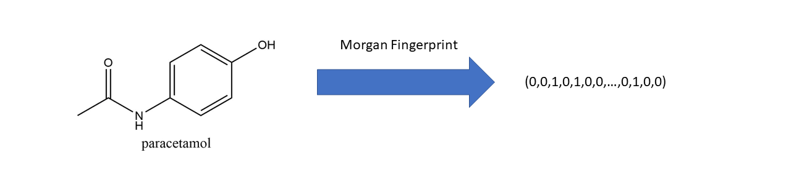
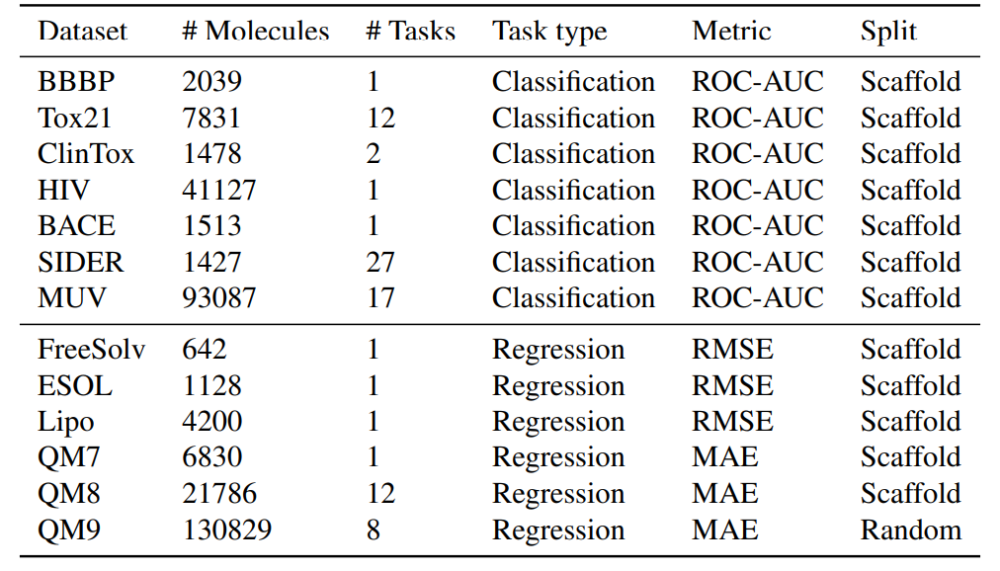
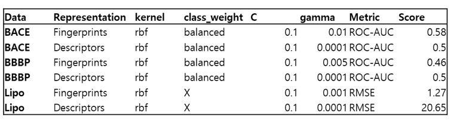

# Kernel-based Learning with Molecules
__2021020636 허종국__

특정한 화학 분자의 용해도, 전기 음성도, 혈관장벽 투과도 등의 물성을 예측하는 것을 __물성예측__ 이라고 합니다. 물성 예측은 신약 개발, 반응 예측 등 다양한 화학 정보학 분야의 태스크에 앞서 가장 먼저 해결해야될 태스크입니다. 머신러닝/딥러닝을 적용하기에 앞서 분자데이터를 모델에 입력하기 위한 전처리 과정이 필요하며 분자의 표현 방식에 따라 다양한 모델 구조가 사용됩니다. 분자의 표현 방식 및 각 표현에 따른 모델은 주로 아래와 같습니다.

## Molecular Representations and Model Structures(Deep Learning)
비정형 데이터를 처리하기 위한 모델로써 트랜스포머 혹은 GNN 계열의 모델을 사용합니다.

1. 결합의 길이, 각도, 모든 원자 간의 거리를 정보로 활용함으로써 __GNN__ 모델을 활용합니다. 하지만 이러한 모든 정보를 가진 데이터셋을 구축하는데에 많은 비용이 든다는 단점이 있습니다.

2. 원자를 node, 결합을 edge로 표현하는 그래프로 표현하면서, __GNN__ 계열의 모델을 활용합니다. 결합의 각도나 길이 등을 고려하지 못하여 [카이랄성 분자](https://ko.wikipedia.org/wiki/%EC%B9%B4%EC%9D%B4%EB%9E%84%EC%84%B1) 혹은 단일 결합의 회전으로 발생하는 [이성질체](https://ko.wikipedia.org/wiki/%EC%9D%B4%EC%84%B1%EC%A7%88%EC%B2%B4) 를 잘 표현하지 못한다는 단점이 있습니다. 또한 GNN 계열의 모델은 Locality 라는 Inductive Bias로 인해 __분자의 크기가 매우 큰 분자 같은 경우 예측 성능이 떨어진다는 단점이 있습니다.__

3. [SMILES 표기 규칙](https://en.wikipedia.org/wiki/Simplified_molecular-input_line-entry_system) 이라는 일련의 표기규칙을 통해 문자열로 표기하여 __RNN__ 이나 __Transformer__ 모델을 통해 물성 예측을 수행합니다. Transformer 계열의 모델은 시퀀스 길이에 상관 없이 Self-Attention을 통해 토큰 간의 상관관계를 볼 수 있기 때문에 매우 큰 분자에도 적합하지만, __고리가 3개 이상인 복잡한 분자 같은 경우 예측 성능이 떨어진다는 단점이 있습니다.__

<p align="center"></p>

## Molecular Representations for Machine Learning
분자를 일련의 과정을 거쳐 정형 데이터로 변환하여 SVM이나 RandomForest로 변환합니다. __본 튜토리얼에서는 아래 두 가지 방법을 통해 분자를 전처리한 후, Kernel SVM을 적용하여 어떠한 분자 표현 방식이 더 적합한지 비교하였습니다.__

1. 분자의 무게, 고리의 개수 등 rdkit에서 제공하는 약 122개의 Molecular Descriptor를 통해 아래와 같이 정형 데이터를 구축합니다.
<p align="center"></p>

2. Molecular Fingerprint란 비정형인 분자구조를 일련의 Hash Function 을 거쳐 일정한 크기의 데이터로 매핑한 것을 뜻합니다. 이러한 Molecular Fingerprint는 ECFP와 Morgan FP를 주로 사용합니다.
Morgan Fingerprint에 대한 자세한 설명은 [링크](https://www.youtube.com/watch?v=T2aHx4wVea8)를 참조해주세요.
<p align="center"></p>

## Table of Contents:
- [Requirements](#requirements)
- [Download Data](#download-data)
- [Kernel SVM](#kernel-svm)
  * [Kernel SVM with Molecular Descriptors](#kernel-svm-with-molecular-descriptors)
  * [Kernel SVM with Molecular Fingerprint](#kernel-svm-with-molecular-fingerprint)
- [References](#references)

# Requirements
rdkit 패키지는 python 3.8이상에서 작동하지 않습니다. 본 튜토리얼을 사용하기 적합한 가상환경을 올려두었으니 아래 명령어를 통해 환경을 구축해주시기 바랍니다.

```
conda env create --file environment.yaml
```

# Download Data
본 튜토리얼에서 사용하는 데이터는 다양한 물성에 대해 이진분류 및 회귀 데이터셋을 제공하는 __MoleculeNet Benchmark__ 의 3가지 데이터셋을 사용하였습니다. 데이터의 용량과 라이센스 문제로 해당 폴더에 [링크](https://drive.google.com/file/d/1aDtN6Qqddwwn2x612kWz9g0xQcuAtzDE/view)를 통해 데이터를 다운받으시길 바랍니다. 혹은 `./data` 라는 폴더를 생성한 후 직접 [MoleculeNet](https://moleculenet.org/)에서 다운 받으실 수 있습니다.

## Data Description
해당 데이터 링크를 통해 다운 받을 수 있는 MoleculeNet Benchmark의 데이터셋은 총 13개로 데이터에 대한 설명은 아래와 같습니다. 본 튜토리얼에서는 이진 분류인 BBBP, BACE/ 회귀 문제인 Lipo 데이터만을 사용합니다.
<p align="center"></p>

# Kernel SVM

본 튜토리얼에서는 rbf kernel svm을 활용하여 3개의 데이터셋에 대해 실험을 진행합니다.
## Kernel SVM with Molecular Descriptors
- [CODE IMPLEMENTATION](https://github.com/JongKook-Heo/Kernel-based-Learning/blob/main/kernel_svm_descriptors.py)

## Kernel SVM with Molecular Fingerprint
- [CODE IMPLEMENTATION](https://github.com/JongKook-Heo/Kernel-based-Learning/blob/main/kernel_svm_fingerprint.py)

## Analysis
6개의 데이터셋의 검증 데이터에 대해 rbf kernel의 하이퍼 파리미터 $C$ 와 $\gamma$ 에 대한 최적의 조합을 찾은 후 테스트 데이터에 대한 성능을 비교합니다. 변수의 개수를 줄이기 위해 __PCA를 사용하여 50개의 주성분__ 을 추출한 후 모델링하였습니다.
아래 그림은 분자의 표현 방식에 따른 5개 데이터에 대한 최적 파라미터의 테스트 데이터 성능입니다. 분자 데이터의 경우, 학습/검증/테스트 데이터가 서로 다른 뼈대(Scaffold)를 가진 분자들로 스플릿하기 때문에 학습/검증/테스트 데이터의 분포가 다릅니다. 따라서 ROC-AUC가 0.5가 넘지 않아도 학습이 실패했다고 단언할 수 없으니 이 점 유의하시기 바랍니다.
<p align="center"></p>

3개의 데이터셋 중 2개의 데이터셋에서 Fingerprint를 통한 분자 표현이 모델링에 더욱 적합하다는 것을 알 수 있습니다. (더욱 많은 데이터셋에서 다양한 반복 실험을 진행하면 결과가 달라질 수도 있습니다.) 이러한 결과를 제공하는 원인은 크게 아래 사항을 생각해볼 수 있습니다.

1. Molecular Descriptor는 RDkit에서 제공하는 분자 특징 122개로 이루어져있지만, MorganFingerprint는 2048길이의 비트로 분자 구조를 표현합니다. PCA를 통해 차원 축소를 진행하여 차원의 크기를 동일하게 하지만 Rdkit에서 제공하는 특징만으로는 올바른 물성을 예측하기 힘들다고 추측할 수 있습니다.

2. Molecular Descriptor는 분자의 크기, 고리의 개수 등 인간이 표현하기 쉬운 특징으로 이루어져있습니다. 반면 MorganFingerprint는 특정한 피처를 지명하여 추출하기보다는, 각 분자를 고유한 해시코드로 변환하기 때문에 데이터의 편향이 적다고 추측할 수 있습니다.
 
# References
## code
- MolCLR : https://github.com/yuyangw/MolCLR
## images
- DMQA Open Seminar(Self-Supervised Learning Methods for Chemical Property Predctions) : http://dmqa.korea.ac.kr/activity/seminar/361
## Preliminaries
- Morgan Fingerprint : https://www.youtube.com/watch?v=T2aHx4wVea8
